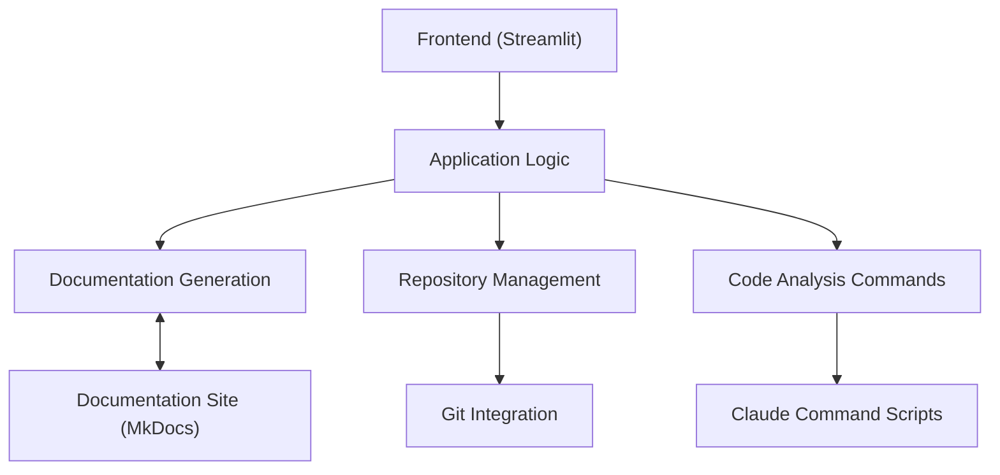
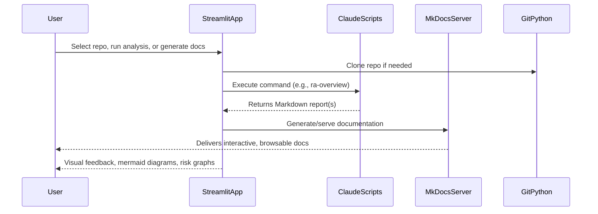

# Architecture Overview – interceptd/ra

---

## 1. Introduction

This document provides a comprehensive, high-level overview of the architecture of the `interceptd/ra` repository. It covers the main components, overall layering, module responsibilities, key technologies, and patterns. It also highlights areas of interest for onboarding and future maintenance.

### 1.1 Run

```
cd frontend/
pip install -r requirements.txt
streamlit run main.py
```

## 2. Main Architectural Layers

The repository follows a modular, layered architecture:



- **Frontend (UI):**  
  Built with Streamlit, providing interactive controls for cloning, selecting, and analyzing repositories.
- **Application Logic:**  
  Orchestrates user actions, command execution, result rendering, and manages concurrent processes.
- **Documentation Generation:**  
  Uses Claude-powered scripts and MkDocs to generate and serve technical documentation and architectural reports.
- **Repository Management:**  
  Handles cloning, branch management, and local workspace setup using GitPython.
- **Code Analysis Layer:**  
  Implements architectural, risk, obsolescence, and migration analyses via command scripts, often leveraging LLMs.
- **External Integrations:**
  - **Git** for repo cloning and management
  - **Claude** for AI-driven code analysis and report generation
  - **MkDocs** for static site documentation

---

## 3. Key Modules, Packages, and Directories

| Directory / File            | Purpose / Summary                                                                             |
| --------------------------- | --------------------------------------------------------------------------------------------- |
| `frontend/`                 | Main Streamlit app, user workflows, UI logic, and orchestration                               |
| `frontend/main.py`          | Core Streamlit app: repo cloning, doc generation, command runner, and markdown viewer         |
| `frontend/requirements.txt` | Python dependencies, including Streamlit, GitPython, mkdocs, and mermaid support              |
| `.claude/commands/`         | Claude prompt scripts for architectural overview, documentation, migration, and risk analysis |
| `README.md`                 | Visual repo banner; minimal direct documentation                                              |
| `commands.md`               | Maps well-known analyses to Claude prompt scripts, enabling UI-driven command selection       |
| `_ra/` (generated)          | MkDocs site output; contains structured docs, logic, and dependency reports                   |

---

## 4. Primary Data Models & External Integrations

### Data Models

- **RepositoryMeta**: In-memory, tracks cloned repositories, assigned ports, and session state.
- **CommandMap**: Maps user-friendly names to Claude/MkDocs command templates (from `commands.md`).
- **Analysis Reports**: `ra-overview.md`, `ra-obsolescence.md`, etc.—Markdown files generated from analysis.

### External Integrations

- **GitPython**: For repo management (clone, branches)
- **Claude (Anthropic LLM)**: For code summarization, architecture, migration, and risk analysis (via prompt scripts)
- **MkDocs + Plugins**: For documentation site generation and serving
- **streamlit-mermaid**: For visualizing generated Mermaid diagrams in-app

---

## 5. Notable Design Patterns and Conventions

- **Command-Driven Analysis:**  
  All architectural, documentation, and migration analyses are mapped to prompt scripts, making the system extensible and AI-driven.
- **Session-Oriented UI:**  
  Streamlit session state is used to manage repo selection, server lifecycle, and user actions.
- **Isolated Analysis Workspace:**  
  Cloned repositories and generated reports are stored in a `workspace` directory, allowing multi-repo workflows.
- **Mermaid for Diagrams:**  
  All architectural and risk graphs are standardized as Mermaid diagrams for portability and clarity.
- **MkDocs Site as Source of Truth:**  
  All generated documentation is served via MkDocs, providing a consistent developer onboarding experience.

---

## 6. Deployment and Execution Flow



---

## 7. Special Patterns & Business Logic

- **Extensible Analysis:**  
  New types of analysis (risk, migration, etc.) are added by creating new prompt scripts and updating `commands.md`.
- **Process Isolation:**  
  Documentation servers are run in isolated processes, with dynamic port assignment tracked by session.
- **LLM-Centric Summaries:**  
  All business logic and documentation are driven by LLM summarization for maintainability and rapid onboarding.

---

## 8. Quick Reference: Technologies Used

- **Python 3.8+**
- **Streamlit** (UI, interactivity)
- **GitPython** (repo management)
- **Claude (Anthropic LLM)** (analysis and documentation)
- **MkDocs** + Plugins (documentation site)
- **Mermaid** (diagram standard)
- **Optional: Azure DevOps** (for ADO repo support)

---

## 9. Onboarding Notes

- To extend or customize analyses, add new prompt scripts under `.claude/commands/` and update `commands.md`.
- All major reports are written to Markdown and can be viewed directly in the app or through the generated MkDocs site.
- Diagrams are always in valid Mermaid syntax, ensuring easy export to developer documentation platforms.

---

_For a detailed directory-by-directory summary, see the generated MkDocs site or `_ra/docs/index.md` after running the documentation command._
